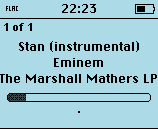
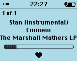
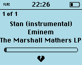

# essential-style

A Rockbox theme for the **iPod 4G greyscale** display (160×128).

Now Playing stays uncluttered: title, artist, album, a full-width progress bar, and a heart rating. The status bar, menus, and icons follow Flattery-B’s layout, with codec icons from Simple Icons.

**Author:** Patrick Stigler  
**License:** [CC BY-SA 3.0](https://creativecommons.org/licenses/by-sa/3.0/)

[](https://ko-fi.com/W7W51C9X4H)

This is a derived work. Flattery-B (Christian Soffke) is licensed CC BY-SA; this theme uses the same license.

## Screenshots

| Unrated | Heart (5–10) | Broken heart (1–4) |
| --- | --- | --- |
|  |  |  |

## Features

- Status bar at the top: play-state icons (pause / ff / rew; blank when stopped), hold, battery
- While playing, the play icon is replaced by a Simple Icons 13×5 codec bitmap
- Clock in the status bar on Now Playing (instead of the text “Now Playing”); 24h/12h follows the Rockbox setting
- Centered track info (title, artist, album) in 14-Nimbus — including äöüß
- Progress bar with 8px inset on both sides, rounded corners and grey fill; no elapsed-time counter
- Rating under the progress bar (`%rr` 0–10): unrated = `·`, 1–4 = broken heart, 5–10 = heart (16×16 ListenBrainz / Font Awesome silhouettes)
- Volume overlay replaces the progress bar while you change volume
- Disk activity: 9×9 spinning broken circle in the bottom-left corner, below the menu
- Uses Rockbox’s 10-Nimbus and 14-Nimbus (not bundled in this repo)

## Requirements

- Apple iPod 4G (greyscale, 160×128)
- [Rockbox](https://www.rockbox.org/) 4.0 or a current development build, including the font pack (**10-Nimbus** and **14-Nimbus**)
- Copying this repo’s `.rockbox` folder onto the player

Rockbox Utility normally installs the font pack. If titles look tiny or wrong after loading the theme, set **Settings → Theme Settings → Font** to 14-Nimbus.

## Install

1. Put Rockbox on the iPod as usual.
2. Copy the `.rockbox` directory from this repository onto the iPod’s root. Merge with the existing `.rockbox` folder; do not replace the whole firmware tree.
3. On the iPod: **Settings → Theme Settings → Browse Themes → essential-style**.

To rate a track: on Now Playing open the context menu and set the track rating (0–10).

## Files

```
.rockbox/
  icons/          menu icon set
  themes/         essential-style.cfg
  wps/            essential-style.wps, essential-style.sbs, bitmaps
                  (including heart.bmp, heartBroken.bmp, diskActivity.bmp)
screenshots/      Now Playing captures (unrated, heart, broken heart)
```

`CHANGELOG.md` stays in the repo root and is not copied onto the iPod.

## Attribution

This theme remixes work by others. Credit them if you redistribute it.

| Source | Author | Used for |
| --- | --- | --- |
| [Flattery-B](http://themes.rockbox.org/index.php?target=ipod4g&themeid=3461) | Christian Soffke | Layout, base skin (SBS), viewports, overall look |
| [ipodVOL](http://themes.rockbox.org/index.php?target=ipod4g&themeid=565) | xameius, submitted by Stephen Carroll | Battery, hold, repeat, speaker, play-state icons |
| [ChicagoUnified](http://themes.rockbox.org/) | Brendan Riera | Shuffle icon (via Flattery-B) |
| [Simple Icons (H120)](http://themes.rockbox.org/index.php?target=ipod4g&themeid=598) | John Bayley, submitted by Stephen Carroll | Codec bitmaps in the status bar |

Changes relative to Flattery-B: renamed to essential-style; codec in the status bar while playing; clock instead of “Now Playing”; heart rating; full-width rounded progress bar without elapsed time; disk activity as a 9×9 bottom-left spinner instead of a dash above the battery; fonts are not bundled (Rockbox’s 10/14-Nimbus); 14-Nimbus is not loaded twice (UI font is reused on the WPS).

## License

[Creative Commons Attribution-ShareAlike 3.0 Unported](https://creativecommons.org/licenses/by-sa/3.0/)

You may share and adapt this theme, including commercially, if you:

1. **Give credit** to Patrick Stigler and the original authors listed above, and link to the license.
2. **Indicate changes** if you modify it.
3. **Share alike** — distribute remixes under CC BY-SA 3.0 (or a compatible license).

The full legal code is at <https://creativecommons.org/licenses/by-sa/3.0/legalcode>.
